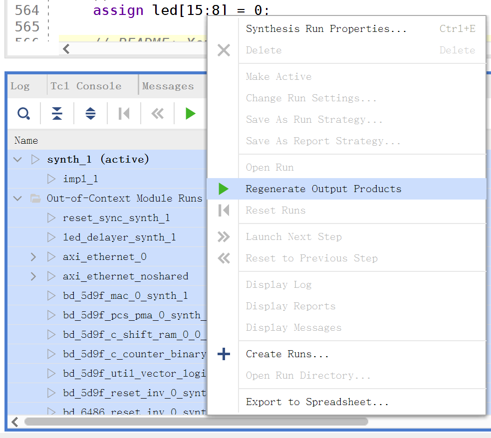

# TanLabs

Tsinghua Advanced Networking Labs

目录说明：

* `tanlabs`：硬件路由器实验框架
* `firmware`：运行在CPU上的软件的框架（固件框架）
* `ibert_7series_gtp_1.25G_ex`：1.25Gbps的IBERT测试工具
* `ibert_7series_gtp_6.25G_ex`：6.25Gbps的IBERT测试工具
* `figures`：仅供参考的图片

克隆本仓库后，第一次综合实验框架前，实验者需要先选择所有模块，然后执行“Regenerate Output Products”，如下图所示。



此外，开始实验前，请实验者先阅读`tanlabs/tanlabs.srcs/sources_1/new/`、`tanlabs/tanlabs.srcs/sim_1/new/`以及`firmware`中所有文件。以下为每个文件的大致说明。

`tanlabs/tanlabs.srcs/sources_1/new/`文件说明：

* `tanlabs.v`：TanLabs实验框架的顶层设计文件，`figures/tanlabs.svg`为实验框架整体设计的示意图。**实验者需要修改此文件来加入CPU，并将CPU和转发引擎连接起来。**
* `reset_sync.v`：异步复位同步释放的电路。
* `led_delayer.v`：LED延迟器，将输入的脉冲信号延长为持续时间至少为10ms的脉冲，方便人眼观察。
* `frame_filter.v`：AXI-Stream协议的丢包器。在某个AXI-Stream包的第一拍将`drop`信号置1即可完整地丢弃当前包。
* `frame_datapath_fifo.v`：AXI-Stream协议的FIFO缓冲区，对AXI-Stream FIFO IP核进行了包装，使其能够在FIFO满时完整地丢弃整个新到达的AXI-Stream包。
* `egress_wrapper.v`：其对出接口进行了包装，加入了FIFO缓冲区以及AXI-Stream宽度转换IP核，并且能够在FIFO满时完整地丢包。
* `frame_datapath.vh`：转发引擎数据通路的头文件，定义了一些信号的结构体（打包的信号）以及一些常量和宏。**实验者可以修改此文件来加入需要的信号、常量或宏等。**
* `frame_datapath.sv`：转发引擎的数据通路设计。**实验者需要对此文件添加大量代码来实现转发引擎的功能。**
* `frame_datapath_example.sv`：实现了若干无用功能的数据通路设计，旨在借助这些无用功能来帮助实验者熟悉实验框架的使用方法。这些无用的功能包括：1）交换一个以太网帧的源MAC地址和目标MAC地址，演示了如何处理并修改以太网帧；2）丢弃所有TTL为奇数的IP分组，演示了如何丢包；3）浪费三个周期而什么都不做，演示了一个多周期的流水线级（pipeline stage），供实现多周期转发表时参考；4）减少IP分组头部TTL而不更新校验和，又一次演示了如何处理并修改以太网帧；5）将出接口设置为入接口来实现回环功能，演示了如何获得入接口以及如何修改出接口。实验者需要根据路由器的工作流程来实现转发引擎，实现过程中可能会用到某些类似的逻辑。
* **此外，实验者还需要为ARP缓存、转发表、CPU等模块建立新的设计文件。**

`tanlabs/tanlabs.srcs/sim_1/new/`文件说明：

* `axis_model.v`：用于仿真时产生AXI-Stream协议输入。其从`frames.txt`中读取以太网帧，并通过AXI-Stream协议发送。
* `axis_receiver.v`：用于仿真时接收AXI-Stream协议输出，供实验者检查。同时，其会将接收的输出写入`out_frames.txt`文件中。
* `clock.v`：用于产生仿真时使用的时钟。
* `tb_frame_datapath.v`：转发引擎数据通路的testbench。实验者通过仿真这一文件即可测试转发引擎。
* `gen_frame`：用于生成测试输入的脚本，其会产生`frames.txt`以及`in_frames.pcap`文件。其中，`frames.txt`用于作为仿真的输入文件（如上所述），`in_frames.pcap`用于方便实验者使用Wireshark打开观察。**建议实验者在该脚本中添加更多测例来测试转发引擎。**
* `txt2pcap`：用于将仿真得到的输出文件转换为PCAP格式文件，方便实验者使用Wireshark打开观察。其输入`out_frames.txt`文件，输出`out_frames.pcap`文件。
* `frames.txt`：脚本生成的仿真输入文件。
* `refout_frames.pcapng`：默认测试输入对应的参考输出，使用Linux系统生成。当实验者的转发引擎基本实现完成后，其输出应当与此文件相似。由于本实验暂时不要求实现ICMP错误消息发送，实验者观察此文件时可暂时忽略ICMP报文。**由于抓包问题，实验者打开此文件观察时，请先按照时间（Time）升序排序。**
* `create_ns`：在Linux中创建一个含有四个虚拟接口的网络命名空间，用于测试。
* **此外，实验者还需要为ARP缓存、转发表、CPU等模块建立新的仿真测试文件。**

请注意，上述PCAP文件中使用VLAN ID标识入接口以及出接口，实际传输的以太网帧不含有VLAN信息。

此外，在使用`tb.sv`进行全系统的仿真前，若实验者设置`FAST_BEHAV=1`，则实验者可以直接开始进行快速行为级仿真。这样的仿真配置略去了SFP接口IP核，将实验框架直接接入AXI-Stream协议仿真模块。此处建议实验者设置`FAST_BEHAV=1`。

若实验者设置`FAST_BEHAV=0`，那么实验者需要先在Tcl Console执行如下命令来开启仿真模式，省略IP核部分初始化等逻辑以加快仿真：

```
set_property CONFIG.SIMULATION_MODE {1} [get_ips axi_ethernet_0 axi_ethernet_noshared]
```

仿真后，在综合并生成bitstream前需要执行如下命令来恢复设置：

```
set_property CONFIG.SIMULATION_MODE {0} [get_ips axi_ethernet_0 axi_ethernet_noshared]
```

关于`firmware`，请阅读`firmware/README.md`。

